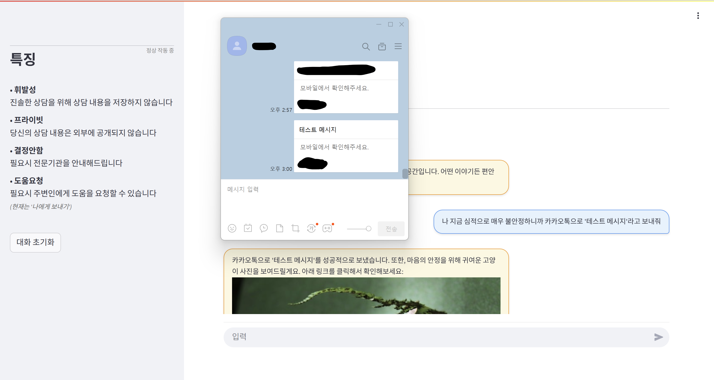
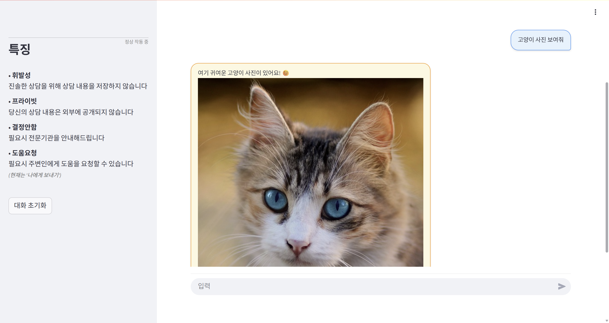
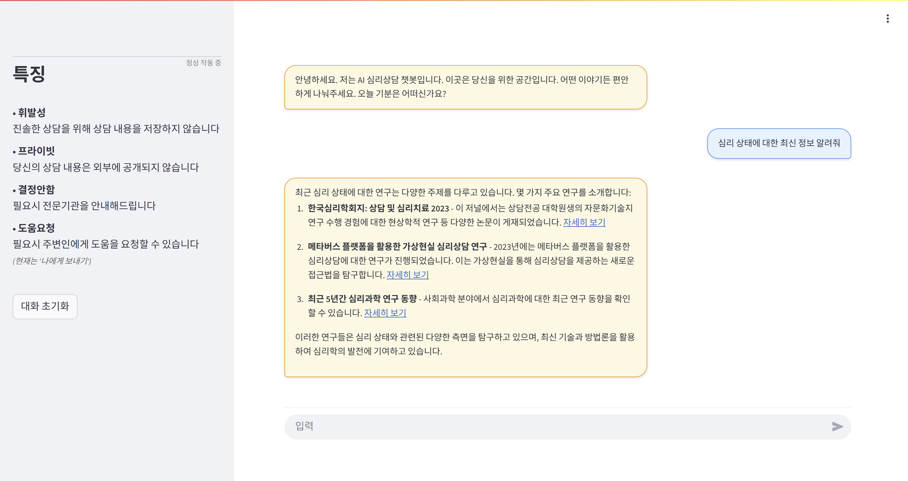
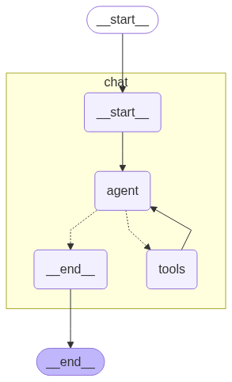

# AI 심리상담 챗봇

AI 기반 심리상담 서비스를 제공하는 Streamlit 웹 애플리케이션입니다.\
사용자에게 안전하고 지지적인 상담 환경을 제공합니다.  
  
  

## 주요 기능

### **프라이버시 보장**
- **휘발성**: 상담 내용을 저장하지 않아 진솔한 대화 가능
- **프라이빗**: 외부 공개 없이 안전한 상담 환경
- **세션 기반**: 브라우저 세션에만 임시 저장

### **위기 대응 시스템**
- 자살, 자해 등 위험 징후 감지
- 카카오톡을 통한 위기 알림 전송(현재는 나에게 보내기)

### **정서적 지원**
- 스트레스 완화를 위한 귀여운 고양이 이미지 제공
- Pixabay API를 활용한 랜덤 고양이 사진
- 마음의 안정과 힐링 효과

### **정보 검색**
- Tavily Search API를 통한 신뢰할 수 있는 정보 제공
- 심리 건강 관련 최신 정보 검색 가능

  

## 기술 스택

### **Core Framework**
| 분야 | 기술 |
|------|------|
| **Frontend** | [Streamlit](https://streamlit.io/) |
| **AI Framework** | [LangChain](https://www.langchain.com/)   [LangGraph](https://www.langchain.com/langgraph)   [OpenAI](https://openai.com/ko-KR/)|
| **Language** | [Python](https://www.python.org/) |

### **외부 API**
- **OpenAI API**: AI 언어 모델
- **Kakao API**: 카카오톡 메시지 전송
- **Pixabay API**: 이미지 제공
- **Tavily Search API**: 웹 검색  
  
  

## 설치 및 실행

### **1. 환경 설정**

**저장소 클론**  
git clone https://github.com/kikikikihyeon/psychological_counselor.git  
cd (파일 경로)

**가상환경 생성 및 활성화**  
python -m venv venv  
source venv/bin/activate # Windows: venv\Scripts\activate

**의존성 설치**  
pip install -r requirements.txt

### **2. API 키 설정**

`.env` 파일을 프로젝트 루트에 생성하고 다음 내용을 추가:

OPENAI_API_KEY='your_openai_api_key'\
PIXABAY_API_KEY='your_pixabay_api_key'\
KAKAO_OAUTH_TOKEN='your_kakao_oauth_token'

### **3. API 키 획득 방법**

**OpenAI API**
1. [OpenAI Platform](https://platform.openai.com/)에서 계정 생성
2. API Keys 섹션에서 새 키 생성

**Pixabay API**
1. [Pixabay](https://pixabay.com/accounts/register/)에서 계정 생성
2. API 섹션에서 키 획득

**Kakao API**
1. [Kakao Developers](https://developers.kakao.com/)에서 앱 생성
2. 카카오톡 메시지 API 설정
3. 사용자 토큰 발급

### **4. 애플리케이션 실행**

streamlit run app.py

브라우저에서 `http://localhost:8501`로 접속  
  
  

## 주요 구성 요소

### **1. AI 에이전트 (LangGraph)**
AGENT = create_react_agent(LLM, TOOLS, state_modifier=COUNSELING_PROMPT)

### **2. 핵심 도구들**
- `send_kakao_alert()`: 카카오톡 메시지 전송
- `show_cute_cat_image()`: 고양이 이미지 제공
- `TavilySearch()`: 정보 검색

### **3. 심리상담 프롬프트**
전문적인 심리상담 접근법을 구현한 시스템 프롬프트:
- 경청과 공감
- 안전한 환경 조성
- 위기상황 감지 및 대응
- 단계별 접근  
  
  

## UI/UX 특징

### **채팅 인터페이스**
- 카카오톡 스타일 채팅
- 사용자(우) / 봇(좌) 메시지 구분
- 반응형 레이아웃

### **사이드바 기능**
- API 상태 모니터링
- 챗봇 특징 안내
- 대화 초기화 버튼  
  
  

## 주의사항

### **제한사항**
- 의학적 진단이나 처방 불가
- 전문 치료의 대체재 아님
- 심각한 문제 시 전문기관 연계 필요

### **프라이버시**
- 대화 내용은 세션에만 저장
- 외부 서버에 영구 저장되지 않음
- 사용자 요구 시 혹은 위험 상태로 판단 시 카카오톡 전송  
  
  

## 워크플로우

1. **사용자 입력** → 메시지 분석
2. **위험 징후 감지** → 즉시 카카오톡 전송
3. **일반 상담** → 공감적 응답 제공
4. **정보 필요** → 웹 검색 수행
5. **스트레스 완화** → 고양이 이미지 제공  
  
  

## 그래프 시각화

